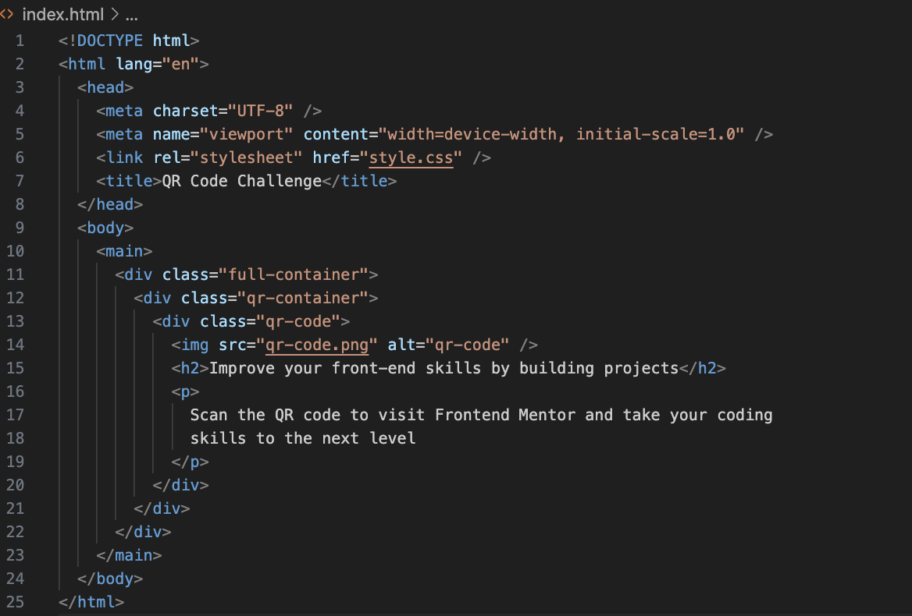
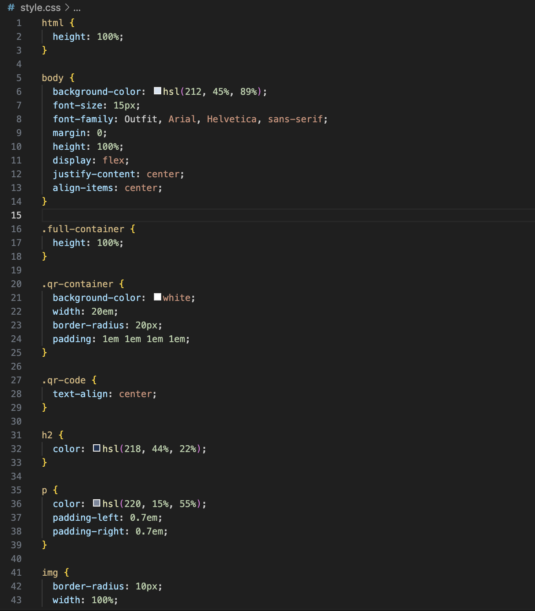

# Frontend Mentor - QR code component solution

This is a solution to the [QR code component challenge on Frontend Mentor](https://www.frontendmentor.io/challenges/qr-code-component-iux_sIO_H). Frontend Mentor challenges help you improve your coding skills by building realistic projects.

## Screenshot of Solution

### Built with

- Semantic HTML5 markup
- CSS custom properties
- Flexbox

### What I learned

I had trouble aligning the qr container to be centered vertically. I realized that the problem was that I added the flex properties (display, justify-content, and align-items) to the container. All I needed to do was add these properties to the body instead after having set the height to 100% in body, html, and the qr container.
